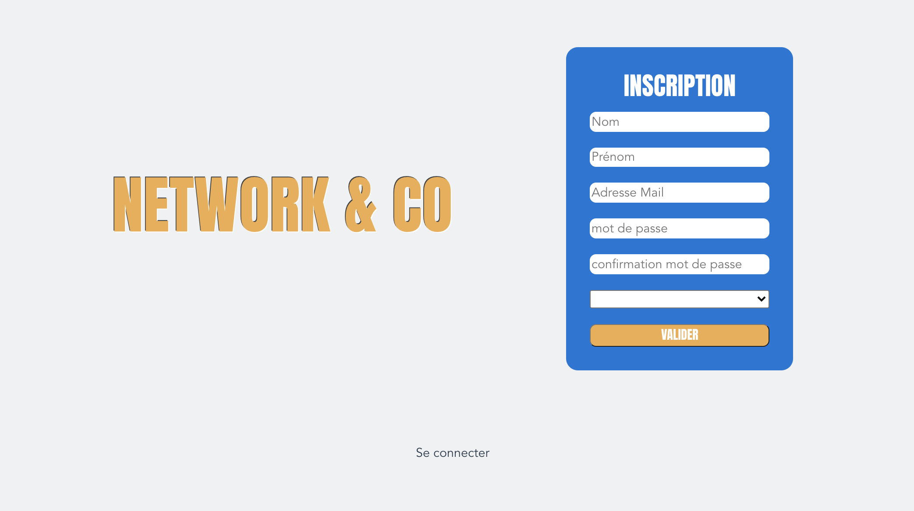
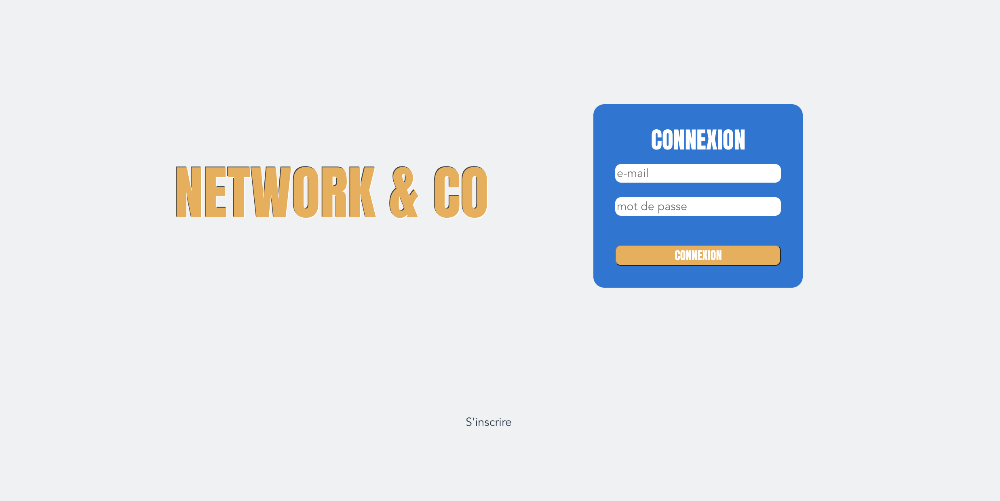
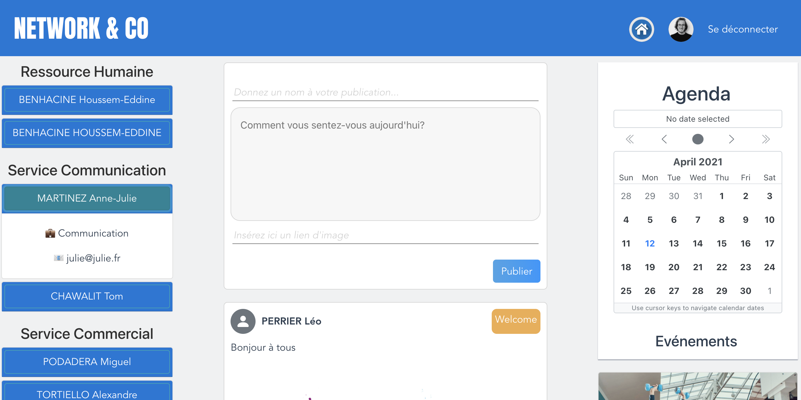
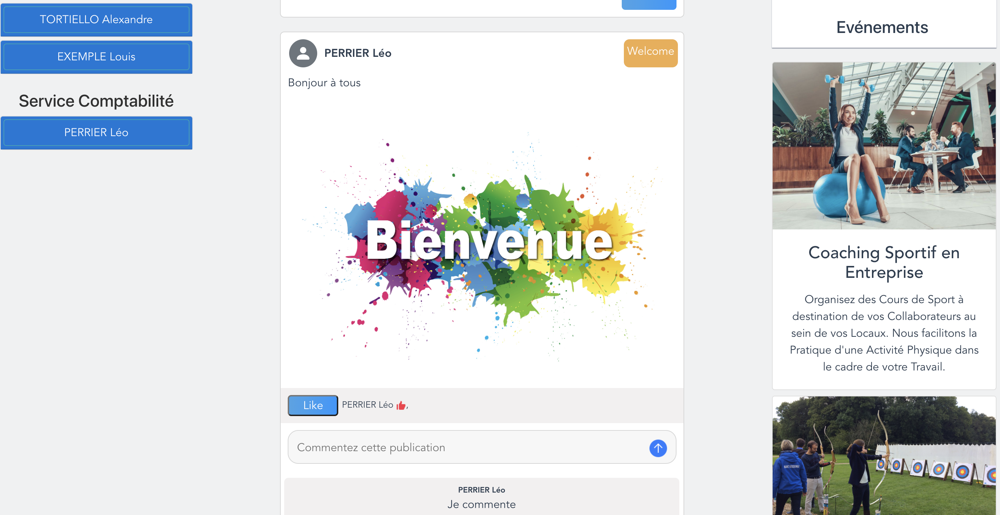
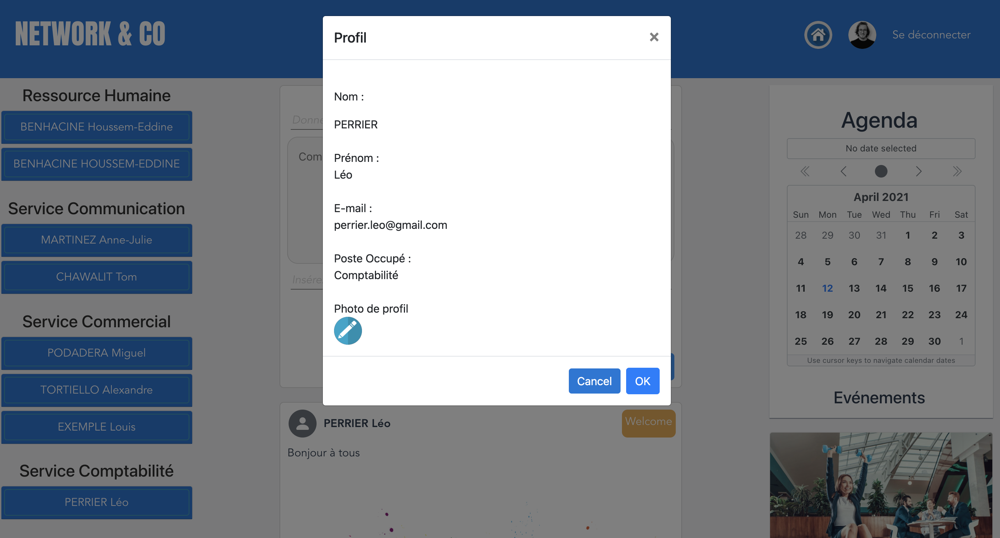

# Network_and_Co

<ul> Network&Co est un réseau interne pour entreprise, le but étant de faire circuler l'information le plus efficacement possible.
  les fonctionnalités sont les suivantes : 
  <li> l'inscription, la connexion & la deconnexion, en faisant des requêtes vers l'API, et en stockant un token de connexion.</li>
  <li> la publication de post, le like de post, et commenter des post.</li>
  <li>  l'édition du profil permmettant de modifier sa catégorie, nom, prénom, mail, mot de passe et d'ajouter une photo de profil.</li>
  <li>  L'agenda permet l'affichage à la date des évènements, réunion, menu de la caféteria.</li>
  </ul>
  
<h2> Page de connection </h2>

<h2> Page d'inscription </h2>

<h2> Fil d'acualité </h2>

<h2> Post, Comment, Like </h2>

<h2> Edition du Profil </h2>

